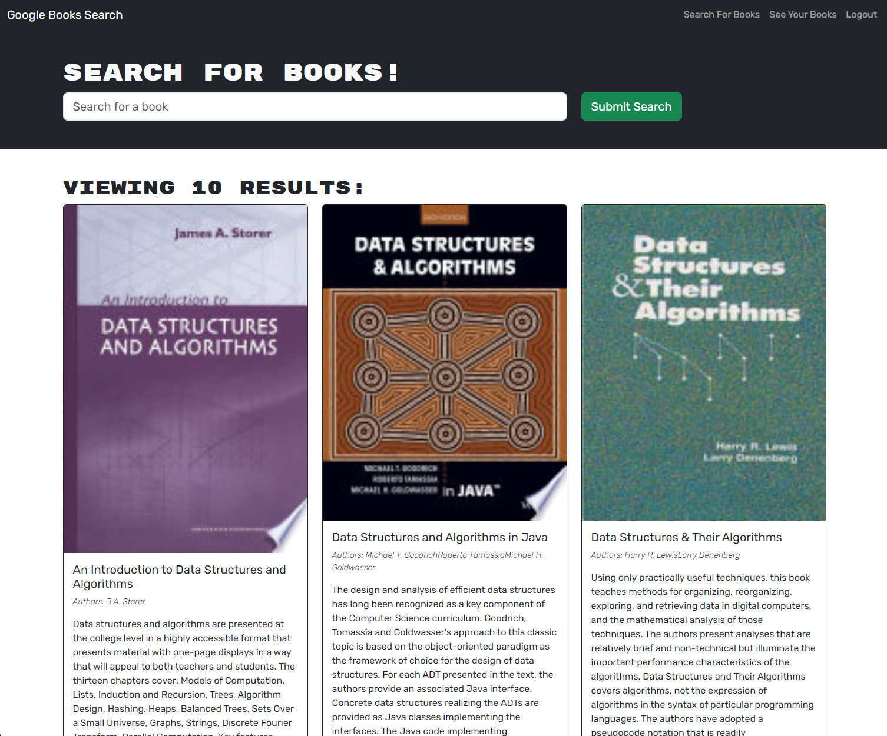

# Book Search Engine

  

## Table of Contents

- [Description](#description)
- [Usage](#usage)
- [Installation](#installation)
- [License](#license)
- [Contributing](#contributing)
- [Tests](#tests)
- [Questions](#questions)

## Description

The Book Search Engine is a web application that allows users to search for books, create an account, and save their favorite books. The application provides a user-friendly interface with the following features:

### Key Features:

- **Home:** Upon loading the search engine, users are presented with a menu featuring options to "Search for Books" and "Login/Signup." The interface includes an input field for book searches and a submit button.

- **Search for Books:** Clicking on the "Search for Books" menu option reveals an input field and a submit button. Users can enter a search term and click the submit button to view search results, including a book's title, author, description, image, and a link to the book on the Google Books site.

- **Login/Signup:** Clicking on the "Login/Signup" menu option triggers a modal with a toggle between login and signup options.

  - **Signup:** When the toggle is set to "Signup," users are presented with inputs for a username, email address, password, and a signup button.

  - **Login:** When the toggle is set to "Login," users are presented with inputs for an email address, password, and a login button.

- **User Authentication:** Upon entering a valid email address and creating a password, users can create an account. Subsequently, users can log in with their email and password. Once logged in, the menu options change to "Search for Books," "Saved Books," and "Logout."

- **Save and Remove Books:** While logged in, users can save search results to their account by clicking a "Save" button. The "Saved Books" option displays all saved books with the ability to remove a book.

- **Logout:** Clicking on the "Logout" button logs the user out and returns them to the home menu.

## Usage

To use the Book Search Engine, follow these steps:

1. Access the deployed application: [Book Search Engine](https://shielded-beyond-73145-20d419db12a1.herokuapp.com/).
2. Navigate the interface using the "Search for Books" and "Login/Signup" options.
3. Search for books, create an account, and save favorite books.
4. Log in and access the "Saved Books" option to manage saved books.

## Installation

No installation is required for the Book Search Engine as it is a web-based application. Simply access the deployed application link.

## License

This project is licensed under the terms of the **[MIT License](https://opensource.org/licenses/MIT)**.

## Contributing

Daniel Merkin

## Tests

No specific testing information is provided at this time.

## Questions

If you have any questions or suggestions about this project, please feel free to contact me:

- GitHub: [@dmerk2](https://github.com/dmerk2)
- Email: dan.merkin@gmail.com
